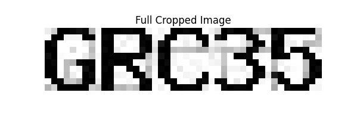
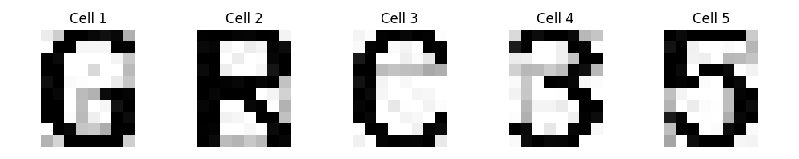
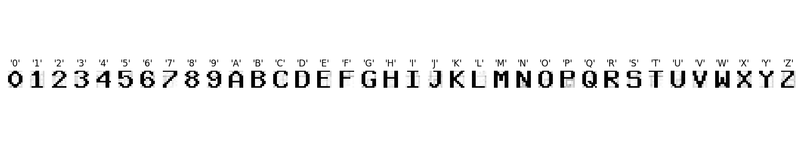
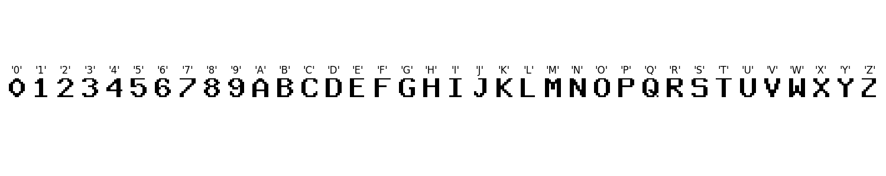

# CAPTCHA Identification: IMDA AI Interview

## Usage
```
python main.py --input sampleCaptchas/input/input05.txt --output result05.txt
Processed 'sampleCaptchas/input/input05.txt' and saved result to 'result05.txt'
```


## Problem Statement
For the IMDA AI Technical Test, we were tasked with identifying CAPTCHAs. The constraints include:
- Limited training data (only 25 samples)
- Simple CAPTCHA generation system
- Each character (A-Z, 0-9) appears at least once in the samples
- Consistent cell dimensions for each character

Therefore, we do not need any deep learning techniques.

## Methodology

### 1. Character Cell Identification
We adopted a template-matching approach. First, we identified that each CAPTCHA image consists of five character cells with consistent dimensions, as illustrated in the segmentation examples below:




### 2. Character Template Creation
For each character in our alphabet (A-Z, 0-9), we:
1. Located all occurrences in the training set
2. Extracted the corresponding cell images
3. Computed a mean representation by averaging pixel values across all instances of each character

This process yielded a dictionary of character templates where each key (character) maps to its representative cell image:



### 3. Noise Reduction
To improve recognition accuracy, we applied preprocessing to both our templates and test images:
1. Grayscale conversion by averaging the RGB channels
2. Thresholding with an empirically determined value of 70 to eliminate background noise
3. This resulted in cleaner character representations:



### 4. Inference Process
For CAPTCHA recognition on new images, we:
1. Segment the image into five character cells
2. Apply the same preprocessing steps (grayscale conversion and thresholding)
3. Compare each cell against our character templates using L1 norm (Manhattan distance)
4. Select the character with the minimum distance for each cell
5. Concatenate the five identified characters to form the complete CAPTCHA solution

## Conclusion
This template-matching approach provides an elegant solution to the CAPTCHA identification task given the constraints. The method leverages the consistency in the CAPTCHA generation system and the comprehensive character coverage in the training samples to achieve reliable recognition without requiring large-scale deep learning models.
